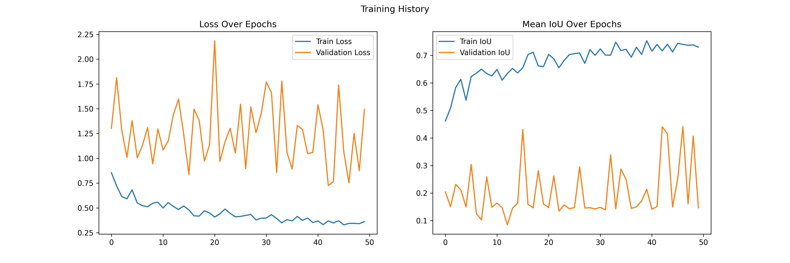
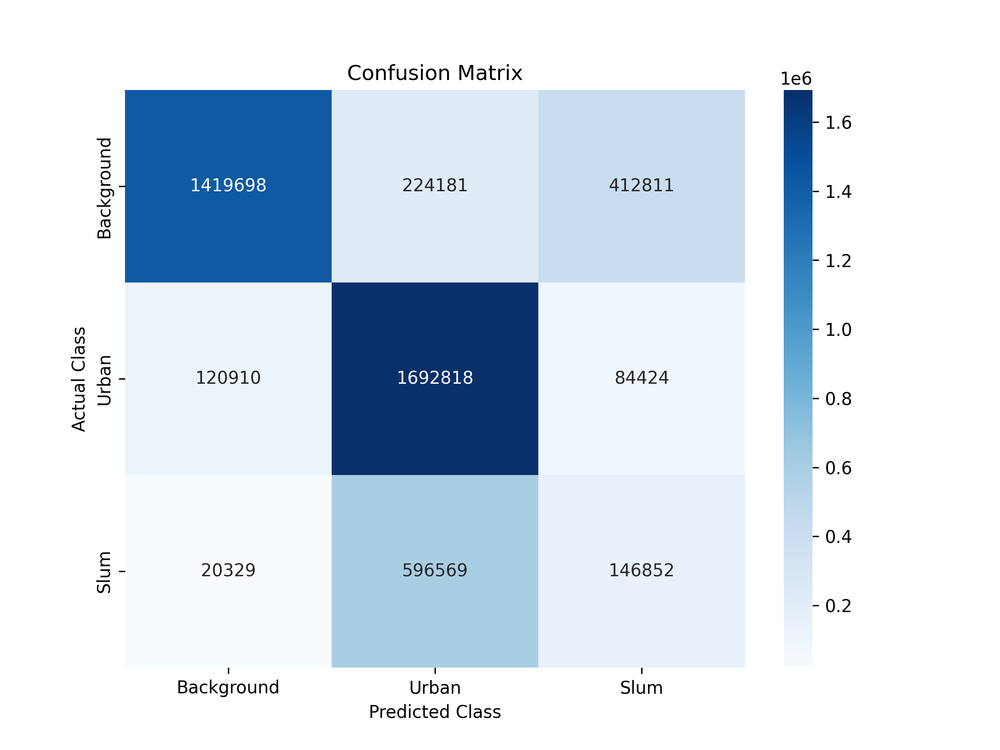
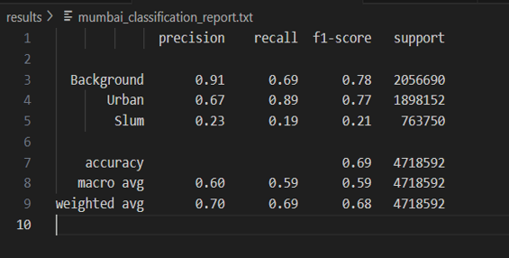

# 🏘️ UNet Model for Slum Area Detection

This project implements a U-Net-based semantic segmentation model to detect slum areas from satellite or aerial images. The model is trained and evaluated on Mumbai data, and performance metrics are visualized below.

---

## 📊 Results

### 🔹 Training and Validation Curves

### 🔹 Confusion Matrix

### 🔹 Performance Table

---

